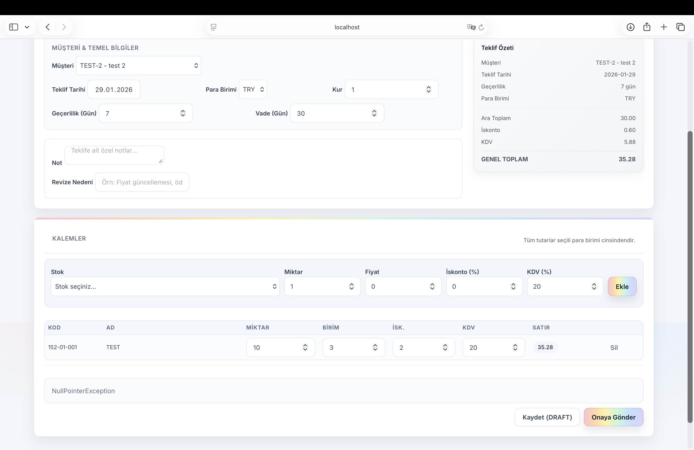
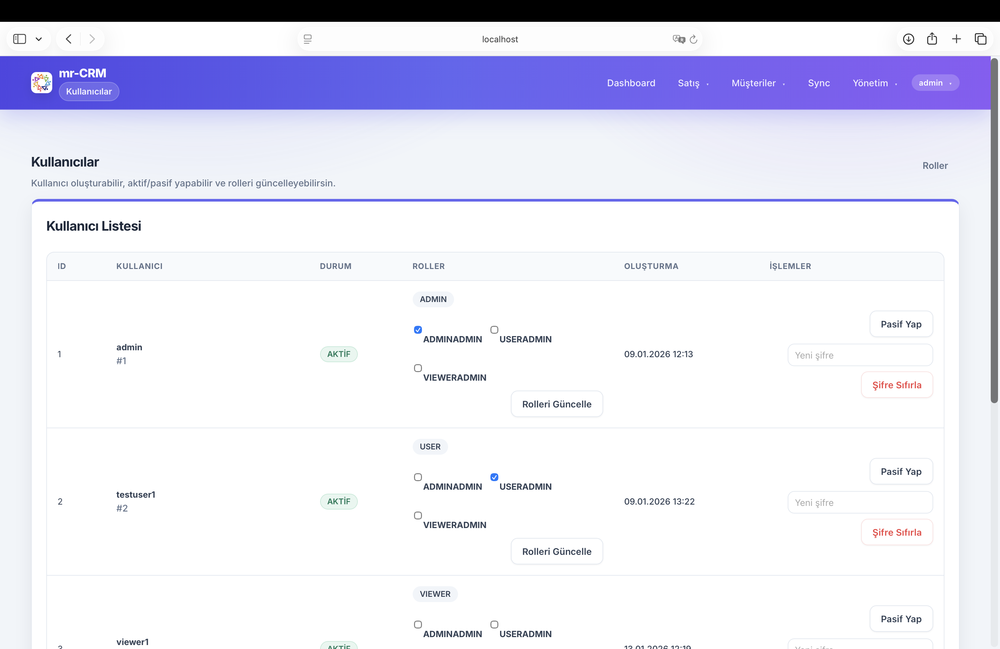
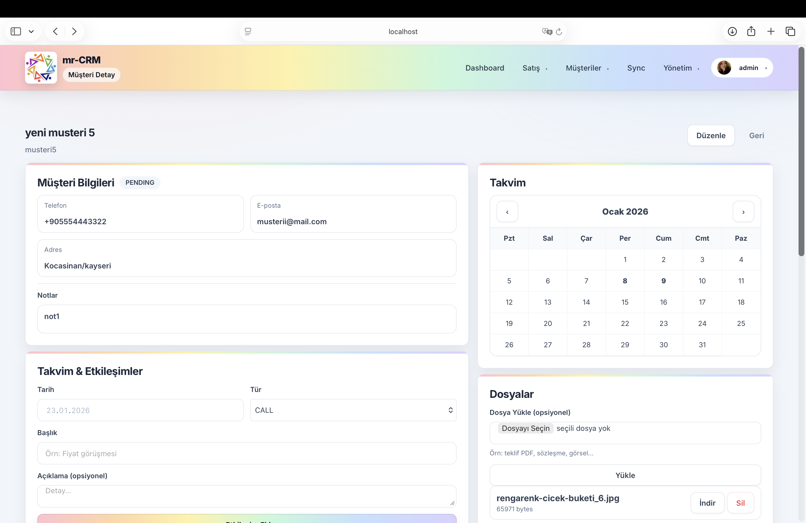
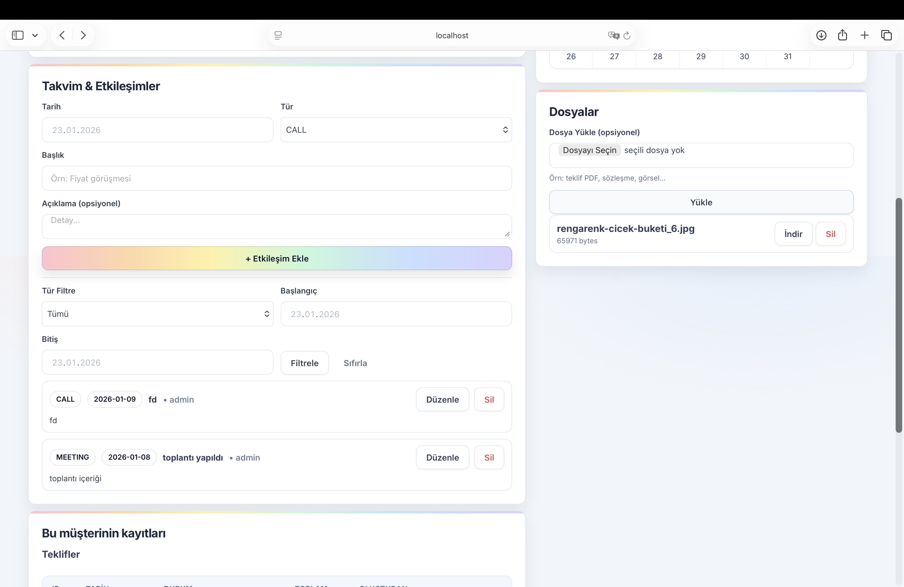
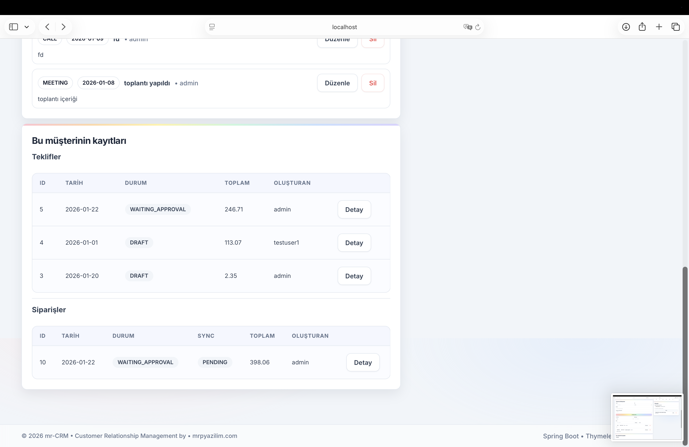
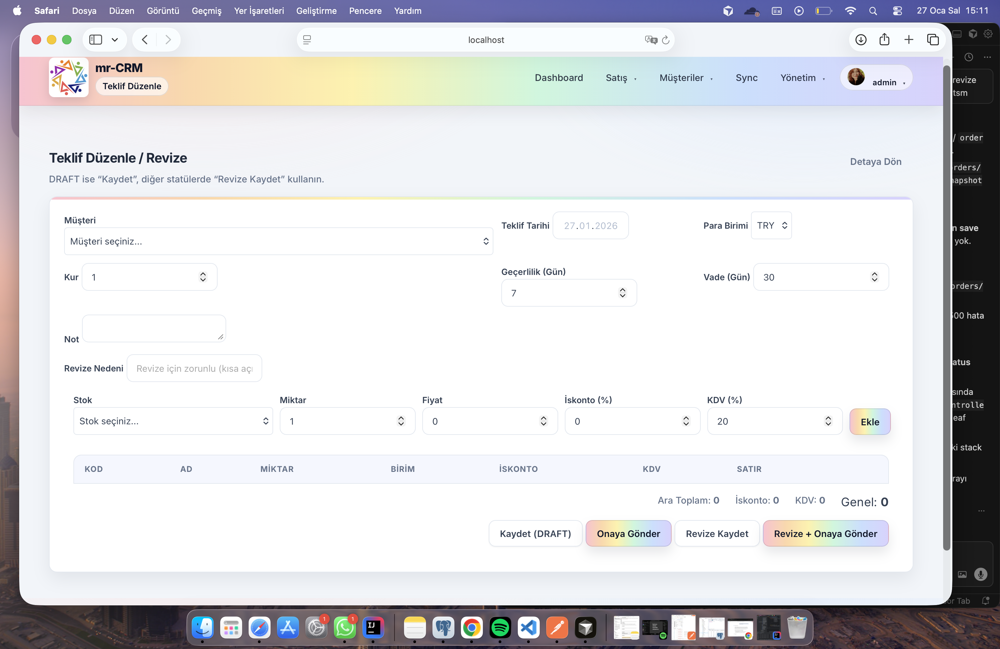

# Order App (mr-CRM)

Enterprise-style CRM application built with Spring Boot, PostgreSQL, and Thymeleaf.

This project started as an internship (staj) application and evolved into a structured CRM-like system that models real-world business workflows including customer management, offer & order lifecycle tracking, ERP integration concepts, revision history, and audit logging.

------------------------------------------------------------

PURPOSE OF THE PROJECT

The goal of this project was to go beyond a simple CRUD application and design a more production-like internal business system with:

- Structured domain separation
- Business workflow transitions
- Role-based authorization
- ERP sync logic
- Revision & audit tracking
- Database migration discipline

It simulates how an internal CRM/ERP-integrated business system would be designed in a real company environment.

------------------------------------------------------------

CORE FEATURES

Authentication & Authorization
- Spring Security based login system
- Role-based access control (ADMIN / USER / VIEWER)
- Protected admin pages

Customer Management
- CRM-style customer records
- Interaction tracking
- Extended customer fields
- Import utilities

Offer Management
- Offer creation & editing
- Workflow transitions
- Revision history support
- Conversion logic

Order Management
- Order creation & lifecycle
- Order revisions
- Status tracking
- Sync state management

Audit & Traceability
- Audit log entity
- Actor tracking
- Metadata storage
- Action-based logging

ERP Integration Concept
- Logo ERP token service
- Sync jobs
- Sync status tracking (PENDING / SYNCED / FAILED)

Admin Tools
- User management
- Role management
- Settings pages
- Export utilities
- Sync monitoring pages

------------------------------------------------------------

ARCHITECTURE OVERVIEW

------------------------------------------------------------

SCREENSHOTS

### Dashboard

### Offers

### Admin Panel

### Customers

### Orders

### Revisions

### Audit Logs

------------------------------------------------------------

Enterprise-style CRM application built with Spring Boot, PostgreSQL, and Thymeleaf.

This project started as an internship (staj) application and evolved into a structured CRM-like system that models real-world business workflows including customer management, offer & order lifecycle tracking, ERP integration concepts, revision history, and audit logging.

------------------------------------------------------------

PURPOSE OF THE PROJECT

The goal of this project was to go beyond a simple CRUD application and design a more production-like internal business system with:

- Structured domain separation
- Business workflow transitions
- Role-based authorization
- ERP sync logic
- Revision & audit tracking
- Database migration discipline

It simulates how an internal CRM/ERP-integrated business system would be designed in a real company environment.

------------------------------------------------------------

CORE FEATURES

Authentication & Authorization
- Spring Security based login system
- Role-based access control (ADMIN / USER / VIEWER)
- Protected admin pages

Customer Management
- CRM-style customer records
- Interaction tracking
- Extended customer fields
- Import utilities

Offer Management
- Offer creation & editing
- Workflow transitions
- Revision history support
- Conversion logic

Order Management
- Order creation & lifecycle
- Order revisions
- Status tracking
- Sync state management

Audit & Traceability
- Audit log entity
- Actor tracking
- Metadata storage
- Action-based logging

ERP Integration Concept
- Logo ERP token service
- Sync jobs
- Sync status tracking (PENDING / SYNCED / FAILED)

Admin Tools
- User management
- Role management
- Settings pages
- Export utilities
- Sync monitoring pages

------------------------------------------------------------

ARCHITECTURE OVERVIEW

 
The application follows a layered architecture:

Client (Browser)
        ↓
Controller Layer
        ↓
Service Layer
        ↓
Repository Layer
        ↓
PostgreSQL Database

Design Characteristics:
- Layered architecture (Controller → Service → Repository)
- Domain-driven folder separation
- Migration-based database versioning (Flyway)
- Explicit workflow modeling (OfferTransitions, OrderTransitions)
- Revision pattern implementation
- Audit logging pattern
- Integration abstraction layer (LogoApiService)

------------------------------------------------------------

TECH STACK

- Java (Spring Boot)
- Spring Security
- Thymeleaf
- PostgreSQL
- Flyway (database migrations)
- Maven

------------------------------------------------------------

PROJECT STRUCTURE (High-Level)

auth/        → authentication & authorization
customer/    → customer domain
offer/       → offer domain + revisions + workflow
order/       → order domain + revisions + workflow
audit/       → audit logging
sync/        → ERP sync logic
admin/       → admin UI & management

Database migrations:
src/main/resources/db/migration/

------------------------------------------------------------

RUNNING THE PROJECT LOCALLY

Requirements:
- Java 17+
- PostgreSQL
- Maven (or use Maven Wrapper)

Database Configuration:

Update:
src/main/resources/application.properties

Example:
spring.datasource.url=jdbc:postgresql://localhost:5432/order_app
spring.datasource.username=postgres
spring.datasource.password=YOUR_PASSWORD

Run:
./mvnw spring-boot:run

Then open:
http://localhost:8080

------------------------------------------------------------

DATABASE MANAGEMENT

This project uses Flyway for schema versioning.

Migration files:
V1__init_schema.sql
...
V20__audit_actor_username_to_text.sql

Migrations run automatically on application startup.

------------------------------------------------------------

SECURITY NOTES

- Default credentials are for development only.
- Production secrets should not be committed.
- Use environment variables or separate profiles for real deployments.

------------------------------------------------------------

FUTURE IMPROVEMENTS

- Docker & Docker Compose setup
- CI pipeline (GitHub Actions)
- Dashboard metrics & analytics
- Retry logic for ERP sync failures
- API documentation (Swagger / OpenAPI)
- REST-first API layer extension

------------------------------------------------------------

STATUS

Active development – evolving toward a more production-ready CRM platform.

------------------------------------------------------------

AUTHOR

Süheyla İkbal İçme
Computer Engineering

Backend & Business Systems Focus

